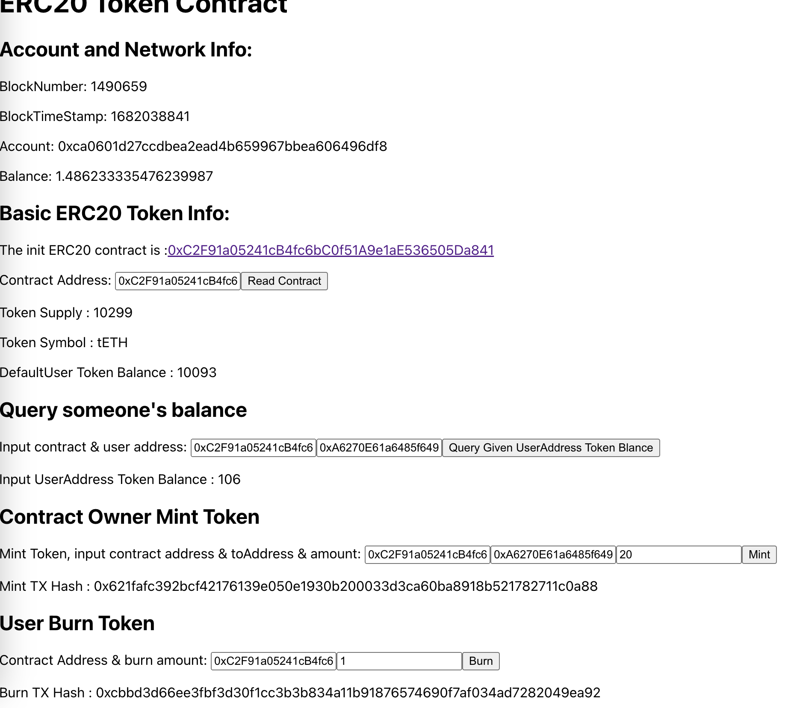

- 支持增发和销毁的ERC20合约 : [0xC2F91a05241cB4fc6bC0f51A9e1aE536505Da841](https://blockscout.scroll.io/address/0xC2F91a05241cB4fc6bC0f51A9e1aE536505Da841)

- [前端](https://5nmvb-5qaaa-aaaan-qc5aa-cai.ic0.app/) : https://5nmvb-5qaaa-aaaan-qc5aa-cai.ic0.app/

## 启动
```
cd frontend/contract-info/
npm start
```


